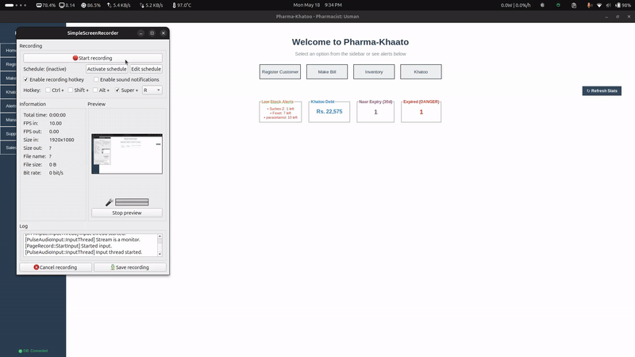
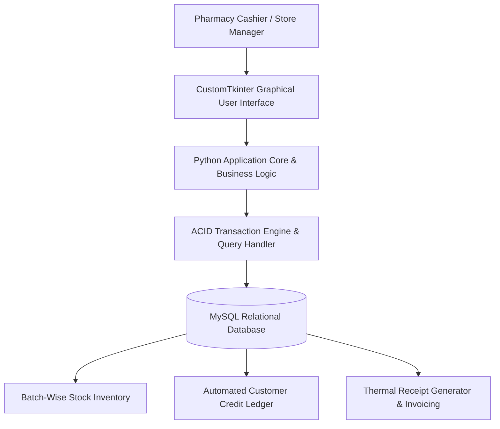

# Pharma-Khaato

<p align="center">
  
  
  
  
  
</p>

Pharma-Khaato is a specialized Point of Sale (POS) and Relational Database Management System (RDBMS) designed for surgical pharmacies. Built with Python and CustomTkinter, it provides an intuitive desktop interface for cashiers, administrators, and inventory managers.

It replaces manual, paper-based record-keeping by providing batch-specific inventory management and an automated customer credit ledger (*Khaato*). The system enforces strict data integrity via a relational MySQL database, ensuring accurate running balance calculations, immutable audit trails for customer debt, and automated expiry-based stock alerts.

> **Key Architecture Highlight:** Implements strict ACID database transactions, preventing race conditions during checkout and automating running-balance updates across customer credit ledgers.

---

## Authors & Contributions

* **Course:** Database Systems — Semester Project
* **Group Members:**
  * **Azaan Noor Khuwaja** *(Roll # 24P-0706)* — Database Schema Design, RDBMS Integration, Application Architecture
  * **Atif Khan** *(Roll # 24P-0540)* — GUI Design, CustomTkinter Interface, Form Validations
  * **Uzair Shoaib** *(Roll # 24P-0507)* — ERD Flow Analysis, SQL Triggers & Procedures, Documentation

---

## Overview & System Visuals

<p align="center">
  
</p>

---

## Quick Start (TL;DR)

Get up and running in under 60 seconds:

```bash
# 1. Clone the repository
git clone https://github.com/aazannoorkhuwaja/Pharma-Khaato.git
cd Pharma-Khaato/project

# 2. Install dependencies
pip install mysql-connector-python pandas customtkinter

# 3. Initialize MySQL Database & Launch Application
mysql -u root -p < database/drawSQL-mysql-export-2026-04-26.sql
python main.py
```

---

## System Architecture Pipeline



---

## Key Features

* **Batch-Wise Inventory Control:** Tracks individual medication batches, stock quantities, supplier metadata, and expiration dates.
* **Automated Customer Credit Ledger (Khaato):** Dynamically calculates outstanding balances and credit history without manual ledger entry.
* **Real-Time Stock Deduction & ACID Integrity:** Guarantees atomic transaction execution during checkout to prevent overselling or data corruption.
* **Expiry Date & Low-Stock Alerts:** Automatically flags expiring batches and triggers low-stock warnings for proactive inventory reordering.
* **Thermal Receipt & Invoice Generation:** Automatically formats and outputs itemized thermal receipts detailing sub-totals, discounts, and default 10% tax calculations.

---

## Technology Stack

* **Frontend / GUI:** Python 3.8+, CustomTkinter (Modern Native Desktop UI)
* **Backend Database:** MySQL 8.0+ (Relational Database Management System)
* **Database Driver:** `mysql-connector-python`
* **Data Processing:** Pandas, NumPy

---

## Comprehensive Task & Component Breakdown

<details>
<summary><b>Point of Sale (POS) & Checkout Engine</b></summary>
<br>

* Real-time product search by barcode, name, or batch number.
* Automated itemized billing with customizable tax and discount fields.
* Instant deduction of batch quantities upon purchase confirmation.
</details>

<details>
<summary><b>Customer Credit Ledger (Khaato Management)</b></summary>
<br>

* Maintains complete customer payment profiles and transaction histories.
* Tracks partial payments and automatically recalculates remaining credit balances.
* Restricts transaction completion if customer credit limits are exceeded.
</details>

<details>
<summary><b>Batch Inventory & Expiry Monitor</b></summary>
<br>

* Allows batch-level stock entry with manufacture and expiration dates.
* Implements First-Expiry-First-Out (FEFO) logic to minimize stock waste.
* Displays visual notifications for medicines nearing expiration.
</details>

---

## Setup & Installation Guide

### 1. Prerequisites Check
Ensure **Python 3.8+** and **MySQL Server** (standalone or via XAMPP/WAMP) are installed:
```bash
python3 --version   # Linux / macOS
python --version    # Windows
mysql --version     # MySQL Server
```

---

### 2. Virtual Environment Setup

**Linux / macOS:**
```bash
python3 -m venv venv
source venv/bin/activate
```

**Windows (Command Prompt):**
```cmd
python -m venv venv
venv\Scripts\activate
```

**Windows (PowerShell):**
```powershell
python -m venv venv
.\venv\Scripts\Activate.ps1
```

---

### 3. Install Required Dependencies
```bash
pip install mysql-connector-python pandas customtkinter
```

---

### 4. Database Setup & Configuration

Create the MySQL database and application user:

```sql
CREATE DATABASE pharmacy_db;
CREATE USER 'pharma'@'localhost' IDENTIFIED BY 'pharma123';
GRANT ALL PRIVILEGES ON pharmacy_db.* TO 'pharma'@'localhost';
FLUSH PRIVILEGES;
```

Import the SQL schema dump to create tables and triggers:
```bash
mysql -u pharma -ppharma123 pharmacy_db < project/database/drawSQL-mysql-export-2026-04-26.sql
```

---

### 5. Running the Application

Navigate to the project execution directory and launch `main.py`:
```bash
cd project
python main.py
```

Alternatively, launch the salesman POS interface directly:
```bash
python salesman_app.py
```

---

## Configuration & Environment Variables

The application connects using standard default parameters but supports customization via Environment Variables:

| Variable Name | Default Value | Description |
|---|---|---|
| `DB_HOST` | `localhost` / `127.0.0.1` | MySQL server host address |
| `DB_PORT` | `3306` | MySQL connection port |
| `DB_USER` | `pharma` | MySQL database username |
| `DB_PASSWORD` | `pharma123` | MySQL database password |
| `DB_NAME` | `pharmacy_db` | Target database name |

---

## Project Directory Structure

```text
Pharma-Khaato/
│
├── README.md                                # Comprehensive documentation & setup guide
├── .gitignore                              # Git exclusion rules
│
├── project/                                 # Main application source directory
│   ├── main.py                              # Application entry point & main interface launcher
│   ├── salesman_app.py                      # Salesman & POS transaction module
│   ├── drawSQL-mysql-export-2026-04-26.sql  # Core database schema & table creation script
│   ├── database/                            # Backup SQL exports & deployment scripts
│   │   └── xampp.sh                         # Optional Linux XAMPP startup script
│   ├── receipts/                            # Generated thermal invoices & billing TXT files
│   └── scripts/                             # Integration testing & system flow tests
│
├── db_project_erd/                          # Database ERD diagrams and schema specifications
│   ├── pharma_khaato_schema.sql             # Relational SQL schema definitions
│   └── Pharma_Khaato__DB_Project_.pdf       # Comprehensive ERD project document
│
└── docs/                                    # Documentation assets & media files
    ├── pharmad.gif                          # Application demonstration GIF
    └── DB-Project-Proposals-4B - Sheet1.pdf  # Project proposal specifications
```

---

## Troubleshooting Guide

| Common Issue | Likely Cause | Resolution |
|---|---|---|
| `mysql.connector.errors.ProgrammingError` | MySQL server down or invalid credentials | Verify MySQL service is running and check environment variables (`DB_USER`, `DB_PASSWORD`) |
| `ModuleNotFoundError: No module named 'customtkinter'` | CustomTkinter library missing | Run `pip install customtkinter` |
| Database connection refused on port 3306 | XAMPP / MariaDB port conflict | Ensure MySQL port matches `DB_PORT` variable (e.g. `3306` or `3307`) |
| Table `pharmacy_db.customers` does not exist | Database schema not imported | Re-run SQL schema import command from step 4 |

---

## Documentation & Project Assets

Detailed database design documents, entity relationship diagrams (ERD), and process flow maps are available in the `db_project_erd/` and `docs/` directories.

---

## License & Citation

Developed for educational and academic research purposes as part of the Database Systems course. Released under the [MIT License](https://opensource.org/licenses/MIT).
